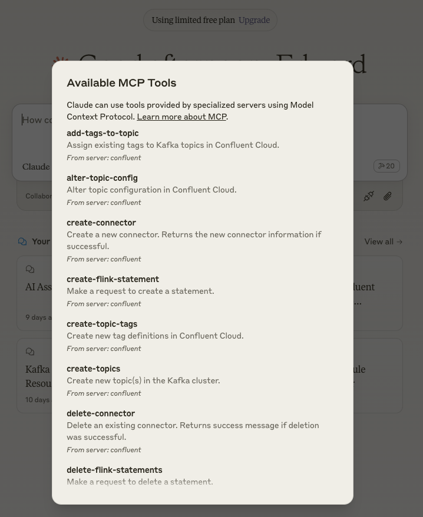
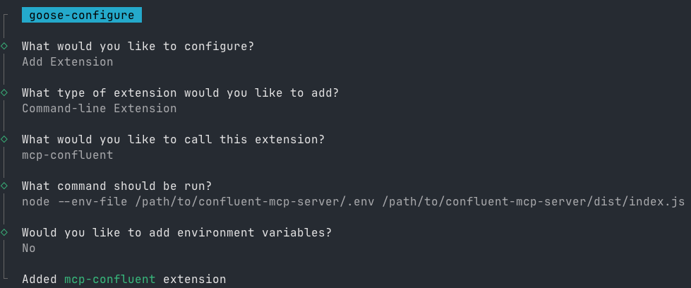

# mcp-confluent

[](https://www.npmjs.com/package/@confluentinc/mcp-confluent)
[](LICENSE)

An [MCP server](https://modelcontextprotocol.io/) that enables AI assistants to interact with Confluent Cloud through natural language. It provides 37+ tools across Kafka, Flink SQL, Schema Registry, Connectors, Tableflow, and more -- usable from any MCP-compatible client including Claude Desktop, Claude Code, Cursor, VS Code, Goose, and Gemini CLI.

<a href="https://glama.ai/mcp/servers/@confluentinc/mcp-confluent">
  
</a>

[](https://deepwiki.com/confluentinc/mcp-confluent)

## Demo

### Goose CLI


### Claude Desktop


## Quick Start

> **Prerequisites:** [Node.js 22+](https://nodejs.org/) and a [Confluent Cloud](https://confluent.cloud/) account.

```bash
# Install and run
npx -y @confluentinc/mcp-confluent -e /path/to/.env
```

Or install the [npm package](https://www.npmjs.com/package/@confluentinc/mcp-confluent) directly. See [Getting Started](#getting-started) for full setup instructions and [Configuring MCP Clients](#configuring-claude-desktop) for integration with your preferred AI tool.

## Table of Contents

- [Quick Start](#quick-start)
- [Available Tools](#available-tools)
- [User Guide](#user-guide)
  - [Getting Started](#getting-started)
  - [Configuration](#configuration)
  - [Authentication for HTTP/SSE Transports](#authentication-for-httpsse-transports)
  - [Environment Variables Reference](#environment-variables-reference)
  - [Usage](#usage)
  - [Configuring MCP Clients](#configuring-claude-desktop)
  - [CLI Usage](#mcp-confluent-cli-usage)
- [Flink Example Workflows](#flink-example-workflows)
- [Developer Guide](#developer-guide)
- [Troubleshooting](#troubleshooting)

## Available Tools

The server provides 37+ tools organized by category. Only the tools whose required environment variables are configured will be enabled.

| Category | Tools | Description |
|----------|-------|-------------|
| **Kafka** | `list-topics`, `create-topics`, `delete-topics`, `produce-message`, `consume-messages`, `alter-topic-config`, `get-topic-config` | Manage topics, produce/consume messages, configure topic settings |
| **Flink SQL** | `create-flink-statement`, `list-flink-statements`, `read-flink-statement`, `delete-flink-statements`, `get-flink-statement-exceptions` | Create and manage Flink SQL statements |
| **Flink Catalog** | `list-flink-catalogs`, `list-flink-databases`, `list-flink-tables`, `describe-flink-table`, `get-flink-table-info` | Explore Flink catalogs, databases, and table schemas |
| **Flink Diagnostics** | `check-flink-statement-health`, `detect-flink-statement-issues`, `get-flink-statement-profile` | Health checks, issue detection, and query profiling |
| **Connectors** | `list-connectors`, `read-connector`, `create-connector`, `delete-connector` | Manage Kafka Connect connectors |
| **Schema Registry** | `list-schemas` | List and inspect data schemas |
| **Catalog & Tags** | `search-topics-by-tag`, `search-topics-by-name`, `create-topic-tags`, `delete-tag`, `remove-tag-from-entity`, `add-tags-to-topic`, `list-tags` | Organize and search topics using tags |
| **Environments & Clusters** | `list-environments`, `read-environment`, `list-clusters` | Discover Confluent Cloud resources |
| **Tableflow** | `create-tableflow-topic`, `list-tableflow-topics`, `read-tableflow-topic`, `update-tableflow-topic`, `delete-tableflow-topic`, `list-tableflow-regions` | Manage Tableflow-enabled topics |
| **Tableflow Catalog** | `create-tableflow-catalog-integration`, `list-tableflow-catalog-integrations`, `read-tableflow-catalog-integration`, `update-tableflow-catalog-integration`, `delete-tableflow-catalog-integration` | Manage Tableflow catalog integrations (e.g., AWS Glue) |
| **Billing** | `list-billing-costs` | Query billing and cost data |

You can also list all available tools via the CLI:

```bash
npx -y @confluentinc/mcp-confluent --list-tools
```

## User Guide

### Getting Started

#### Prerequisites

- **Node.js 22 or later** -- we recommend using [NVM](https://github.com/nvm-sh/nvm) to manage versions:
  ```bash
  nvm install 22
  nvm use 22
  ```
- A **Confluent Cloud** account with appropriate API keys

#### Setup

1. **Create a `.env` file:**  Copy the provided `.env.example` file to `.env` in the root of your project:
   ```bash
   cp .env.example .env
   ```
2. **Populate the `.env` file:** Fill in the necessary values for your Confluent Cloud environment.  See the [Configuration](#configuration) section for details on each variable.

### Configuration

Copy `.env.example` to `.env` in the root directory and fill in your values. See the example structure below:

<details>
<summary>Example .env file structure</summary>

```properties
# .env file
BOOTSTRAP_SERVERS="pkc-v12gj.us-east4.gcp.confluent.cloud:9092"
KAFKA_API_KEY="..."
KAFKA_API_SECRET="..."
KAFKA_REST_ENDPOINT="https://pkc-v12gj.us-east4.gcp.confluent.cloud:443"
KAFKA_CLUSTER_ID=""
KAFKA_ENV_ID="env-..."
FLINK_ENV_ID="env-..."
FLINK_ORG_ID=""
FLINK_REST_ENDPOINT="https://flink.us-east4.gcp.confluent.cloud"
FLINK_ENV_NAME=""
FLINK_DATABASE_NAME=""
FLINK_API_KEY=""
FLINK_API_SECRET=""
FLINK_COMPUTE_POOL_ID="lfcp-..."
TABLEFLOW_API_KEY=""
TABLEFLOW_API_SECRET=""
CONFLUENT_CLOUD_API_KEY=""
CONFLUENT_CLOUD_API_SECRET=""
CONFLUENT_CLOUD_REST_ENDPOINT="https://api.confluent.cloud"
SCHEMA_REGISTRY_API_KEY="..."
SCHEMA_REGISTRY_API_SECRET="..."
SCHEMA_REGISTRY_ENDPOINT="https://psrc-zv01y.northamerica-northeast2.gcp.confluent.cloud"
```

</details>

#### Prerequisites & Setup for Tableflow Commands

In order to leverage **Tableflow commands** to interact with your data ecosystem and successfully execute these Tableflow commands and manage resources (e.g., interacting with data storage like AWS S3 and metadata catalogs like AWS Glue), certain **IAM (Identity and Access Management) permissions** and configurations are essential.

It is crucial to set up the necessary roles and policies in your cloud environment (e.g., AWS) and link them correctly within Confluent Cloud. This ensures your Flink SQL cluster, which powers Tableflow, has the required authorization to perform operations on your behalf.

Please refer to the following Confluent Cloud documentation for detailed instructions on setting up these permissions and integrating with custom storage and Glue:

- **Confluent Cloud Tableflow Quick Start with Custom Storage & Glue:**
    [https://docs.confluent.io/cloud/current/topics/tableflow/get-started/quick-start-custom-storage-glue.html](https://docs.confluent.io/cloud/current/topics/tableflow/get-started/quick-start-custom-storage-glue.html)

Ensuring these prerequisites are met will prevent authorization errors when the `mcp-server` attempts to provision or manage Tableflow-enabled tables.

### Authentication for HTTP/SSE Transports

When using HTTP or SSE transports, the MCP server requires API key authentication to prevent unauthorized access and protect against DNS rebinding attacks. This is **enabled by default**.

#### Generating an API Key

Generate a secure API key using the built-in utility:

```bash
npx @confluentinc/mcp-confluent --generate-key
```

This will output a 64-character key generated using secure cryptography:

```
Generated MCP API Key:
================================================================
a1b2c3d4e5f6...your-64-char-key-here...
================================================================

```

#### Configuring Authentication

Add the generated key to your `.env` file:

```properties
# MCP Server Authentication (required for HTTP/SSE transports)
MCP_API_KEY=your-generated-64-char-key-here
```

#### Making Authenticated Requests

Include the API key in the `cflt-mcp-api-Key` header for all HTTP/SSE requests:

```bash
curl -H "cflt-mcp-api-Key: your-api-key" http://localhost:8080/mcp
```

#### DNS Rebinding Protection

The server includes additional protections against DNS rebinding attacks:

- **Host Header Validation**: Only requests with allowed Host headers are accepted

Configure allowed hosts if needed:

```properties
# Allow additional hosts (comma-separated)
MCP_ALLOWED_HOSTS=localhost,127.0.0.1,myhost.local
```

#### Additional security to prevent internet exposure of MCP server

- **Localhost Binding**: Server binds to `127.0.0.1` by default (not `0.0.0.0`)

#### Disabling Authentication (Development Only)

For local development, you can disable authentication:

```bash
# Via CLI flag
npx @confluentinc/mcp-confluent -e .env --transport http --disable-auth

# Or via environment variable
MCP_AUTH_DISABLED=true
```

> **Warning:** Never disable authentication in production or when the server is network-accessible.

### Environment Variables Reference

| Variable                      | Description                                                                                                                               | Default Value             | Required |
| ----------------------------- | ----------------------------------------------------------------------------------------------------------------------------------------- | ------------------------- | -------- |
| HTTP_HOST                     | Host to bind for HTTP transport. Defaults to localhost only for security.                                                                  | "127.0.0.1"               | Yes      |
| HTTP_MCP_ENDPOINT_PATH        | HTTP endpoint path for MCP transport (e.g., '/mcp') (string)                                                                              | "/mcp"                    | Yes      |
| HTTP_PORT                     | Port to use for HTTP transport (number (min: 0))                                                                                          | 8080                      | Yes      |
| LOG_LEVEL                     | Log level for application logging (trace, debug, info, warn, error, fatal)                                                                | "info"                    | Yes      |
| MCP_API_KEY                   | API key for HTTP/SSE authentication. Generate using `--generate-key`. Required when auth is enabled.                                       |                           | No*      |
| MCP_AUTH_DISABLED             | Disable authentication for HTTP/SSE transports. WARNING: Only use in development environments.                                             | false                     | No       |
| MCP_ALLOWED_HOSTS             | Comma-separated list of allowed Host header values for DNS rebinding protection.                                                           | "localhost,127.0.0.1"     | No       |
| SSE_MCP_ENDPOINT_PATH         | SSE endpoint path for establishing SSE connections (e.g., '/sse', '/events') (string)                                                     | "/sse"                    | Yes      |
| SSE_MCP_MESSAGE_ENDPOINT_PATH | SSE message endpoint path for receiving messages (e.g., '/messages', '/events/messages') (string)                                         | "/messages"               | Yes      |
| BOOTSTRAP_SERVERS             | List of Kafka broker addresses in the format host1:port1,host2:port2 used to establish initial connection to the Kafka cluster (string)   |                           | No       |
| CONFLUENT_CLOUD_API_KEY       | Master API key for Confluent Cloud platform administration, enabling management of resources across your organization (string (min: 1))   |               | No       |
| CONFLUENT_CLOUD_API_SECRET    | Master API secret paired with CONFLUENT_CLOUD_API_KEY for comprehensive Confluent Cloud platform administration (string (min: 1))         |               | No       |
| CONFLUENT_CLOUD_REST_ENDPOINT | Base URL for Confluent Cloud's REST API services (default)                                                                                |               | No       |
| FLINK_API_KEY                 | Authentication key for accessing Confluent Cloud's Flink services, including compute pools and SQL statement management (string (min: 1)) |               | No       |
| FLINK_API_SECRET              | Secret token paired with FLINK_API_KEY for authenticated access to Confluent Cloud's Flink services (string (min: 1))                     |               | No       |
| FLINK_COMPUTE_POOL_ID         | Unique identifier for the Flink compute pool, must start with 'lfcp-' prefix (string)                                                     |               | No       |
| FLINK_DATABASE_NAME           | Name of the associated Kafka cluster used as a database reference in Flink SQL operations (string (min: 1))                               |               | No       |
| FLINK_ENV_ID                  | Unique identifier for the Flink environment, must start with 'env-' prefix (string)                                                       |               | No       |
| FLINK_ENV_NAME                | Human-readable name for the Flink environment used for identification and display purposes (string (min: 1))                              |               | No       |
| FLINK_ORG_ID                  | Organization identifier within Confluent Cloud for Flink resource management (string (min: 1))                                            |               | No       |
| FLINK_REST_ENDPOINT           | Base URL for Confluent Cloud's Flink REST API endpoints used for SQL statement and compute pool management (string)                       |               | No       |
| KAFKA_API_KEY                 | Authentication credential (username) required to establish secure connection with the Kafka cluster (string (min: 1))                     |               | No       |
| KAFKA_API_SECRET              | Authentication credential (password) paired with KAFKA_API_KEY for secure Kafka cluster access (string (min: 1))                          |               | No       |
| KAFKA_CLUSTER_ID              | Unique identifier for the Kafka cluster within Confluent Cloud ecosystem (string (min: 1))                                                |               | No       |
| KAFKA_ENV_ID                  | Environment identifier for Kafka cluster, must start with 'env-' prefix (string)                                                          |               | No       |
| KAFKA_REST_ENDPOINT           | REST API endpoint for Kafka cluster management and administration (string)                                                                |               | No       |
| SCHEMA_REGISTRY_API_KEY       | Authentication key for accessing Schema Registry services to manage and validate data schemas (string (min: 1))                           |               | No       |
| SCHEMA_REGISTRY_API_SECRET    | Authentication secret paired with SCHEMA_REGISTRY_API_KEY for secure Schema Registry access (string (min: 1))                             |               | No       |
| SCHEMA_REGISTRY_ENDPOINT      | URL endpoint for accessing Schema Registry services to manage data schemas (string)                                                       |               | No       |
| TABLEFLOW_API_KEY             | Authentication key for accessing Confluent Cloud's Tableflow services (string (min: 1))                                                   |               | No       |
| TABLEFLOW_API_SECRET          | Authentication secret paired with TABLEFLOW_API_KEY for secure Tableflow access (string (min: 1))                                         |               | No       |

### Usage

This MCP server is designed to be used with various MCP clients, such as Claude Desktop or Goose CLI/Desktop.  The specific configuration and interaction will depend on the client you are using.  However, the general steps are:

1. **Start the Server:** You can run the MCP server in one of two ways:
   - **From source:** Follow the instructions in the [Developer Guide](#developer-guide) to build and run the server from source. This typically involves:
     - Installing dependencies (`npm install`)
     - Building the project (`npm run build` or `npm run dev`)
   - **With npx:** You can start the server directly using npx (no build required):

     ```bash
     npx -y @confluentinc/mcp-confluent -e /path/to/confluent-mcp-server/.env
     ```

2. **Configure your MCP Client:**  Each client will have its own way of specifying the MCP server's address and any required credentials.  You'll need to configure your client (e.g., Claude, Goose) to connect to the address where this server is running (likely `localhost` with a specific port). The port the server runs on may be configured by an environment variable.

3. **Start the MCP Client:**  Once your client is configured to connect to the MCP server, you can start your mcp client and on startup - it will stand up an instance of this MCP server locally.  This instance will be responsible for managing data schemas and interacting with Confluent Cloud on your behalf.

4. **Interact with Confluent through the Client:** Once the client is connected, you can use the client's interface to interact with Confluent Cloud resources.  The client will send requests to this MCP server, which will then interact with Confluent Cloud on your behalf.

### Configuring Claude Desktop

See [here](https://modelcontextprotocol.io/quickstart/user) for more details about installing Claude Desktop and MCP servers.

To configure Claude Desktop to use this MCP server:

1. **Open Claude Desktop Configuration**
   - On Mac: `~/Library/Application\ Support/Claude/claude_desktop_config.json`
   - On Windows: `%APPDATA%\Claude\claude_desktop_config.json`

2. **Edit Configuration File**
   - Open the config file in your preferred text editor
   - Add or modify the configuration using one of the following methods:

   <details>
   <summary>Option 1: Run from source</summary>

   ```json
   {
     "mcpServers": {
       "confluent": {
         "command": "node",
         "args": [
           "/path/to/confluent-mcp-server/dist/index.js",
            "--env-file",
           "/path/to/confluent-mcp-server/.env"
         ]
       }
     }
   }
   ```

   </details>

   <details>
   <summary>Option 2: Run from npx</summary>

   ```json
   {
     "mcpServers": {
       "confluent": {
         "command": "npx",
         "args": [
           "-y",
           "@confluentinc/mcp-confluent",
           "-e",
           "/path/to/confluent-mcp-server/.env"
         ]
       }
     }
   }
   ```

   </details>

   Replace `/path/to/confluent-mcp-server/` with the actual path where you've installed this MCP server.

3. **Restart Claude Desktop**
   - Close and reopen Claude Desktop for the changes to take effect
   - The MCP server will automatically start when Claude Desktop launches

Now Claude Desktop will be configured to use your local MCP server for Confluent interactions.



### Configuring Goose CLI

See [here](https://block.github.io/goose/docs/quickstart#install-an-extension) for detailed instructions on how to install the Goose CLI.

Once installed, follow these steps:

1. **Run the Configuration Command:**

   ```bash
   goose configure
   ```

2. **Follow the Interactive Prompts:**
   - Select `Add extension`
   - Choose `Command-line Extension`
   - Enter `mcp-confluent` as the extension name
   - Choose one of the following configuration methods:

   <details>
   <summary>Option 1: Run from source</summary>

   ```bash
   node /path/to/confluent-mcp-server/dist/index.js --env-file /path/to/confluent-mcp-server/.env
   ```

   </details>

   <details>
   <summary>Option 2: Run from npx</summary>

   ```bash
   npx -y @confluentinc/mcp-confluent -e /path/to/confluent-mcp-server/.env
   ```

   </details>

Replace `/path/to/confluent-mcp-server/` with the actual path where you've installed this MCP server.



### Configuring Gemini CLI

For detailed information about Gemini CLI extensions and MCP servers, please refer to the official documentation:

- [Gemini CLI Extensions](https://github.com/google-gemini/gemini-cli/blob/main/docs/extension.md)
- [Gemini CLI MCP Server Tools](https://github.com/google-gemini/gemini-cli/blob/main/docs/tools/mcp-server.md)

Here's how to get `mcp-confluent` running with Gemini CLI:

1. **Install Gemini CLI:**
    If you haven't already, install the Gemini CLI. You can find installation instructions on the [official GitHub repository](https://github.com/google-gemini/gemini-cli).

2. **Install the `mcp-confluent` Extension:**

    ```bash
    gemini extensions install https://github.com/confluentinc/mcp-confluent 
    # Navigate to the root directory of this project (where `gemini-extension.json` is located) and run:
    # gemini extensions install .
    ```

    This command registers the `mcp-confluent` server with Gemini CLI and creates a dedicated directory for it under `~/.gemini/extensions/mcp-confluent`.

3. **Provide Environment Variables:**
    The extension requires your Confluent Cloud credentials and configuration to be available in a `.env` file.

    - First, ensure you have a correctly populated `.env` file in the root of this project. For instructions, see the [Configuration](#configuration) section.
    - Next, copy your `.env` file into the extension's directory so Gemini CLI can access it (the Gemini extension expects the `.env` file at `${extensionPath}${pathSeparator}.env`; see [the variables documentation](https://github.com/google-gemini/gemini-cli/blob/main/docs/extension.md#variables) for details):

    ```bash
    cp .env ~/.gemini/extensions/mcp-confluent/.env
    ```

4. **Verify and Use:**
    You can now start using the Confluent tools via Gemini CLI. To verify that the tools are available, you can list them:

    ```bash
    gemini -l
    # or `gemini extensions list`
    ```

    And here's an example of invoking a tool:

    ```bash
    
    gemini
    ....

    🟢 mcp-confluent (from mcp-confluent) - Ready (24 tools)
    ....
    
    Using: 1 MCP server (ctrl+t to toggle)
    ╭───────────────────────────────────────────────────────────────────────────────────────────────────────────────────────────────────────────────────────────╮
    │ > list topics                                                                                                                                             │
    ╰───────────────────────────────────────────────────────────────────────────────────────────────────────────────────────────────────────────────────────────╯

    ╭────────────────────────────────────────────────────────────────────────────────────────────────────────────────────────────────────────────────────╮
    │ ✓  list-topics (mcp-confluent MCP Server) {}                                                                                                       │
    │                                                                                                                                                    │
    │    Kafka topics:                                                                                                                                   │
    │    products_summarized,products,topic_8,products_summarized_with_embeddings,elastic_minimized,user_message_related_products,user_message_embeddin  │
    │    gs,dlq-lcc-d3738o,user_message,elastic                                                                                          │
    ╰────────────────────────────────────────────────────────────────────────────────────────────────────────────────────────────────────────────────────╯
    ✦ Okay, I see the following topics: products_summarized, products, topic_8, products_summarized_with_embeddings, elastic_minimized,
      user_message_related_products, user_message_embeddings, dlq-lcc-d3738o, user_message, and elastic.

    ```

### Configuring Claude Code

[Claude Code](https://docs.anthropic.com/en/docs/claude-code) supports MCP servers natively. Add the server to your project configuration:

```bash
claude mcp add confluent -- npx -y @confluentinc/mcp-confluent -e /path/to/.env
```

Or add it to your `.mcp.json` file directly:

```json
{
  "mcpServers": {
    "confluent": {
      "command": "npx",
      "args": [
        "-y",
        "@confluentinc/mcp-confluent",
        "-e",
        "/path/to/.env"
      ]
    }
  }
}
```

### Configuring Cursor

Add the MCP server to your Cursor configuration at `~/.cursor/mcp.json`:

```json
{
  "mcpServers": {
    "confluent": {
      "command": "npx",
      "args": [
        "-y",
        "@confluentinc/mcp-confluent",
        "-e",
        "/path/to/.env"
      ]
    }
  }
}
```

See the [Cursor MCP documentation](https://docs.cursor.com/context/model-context-protocol) for more details.

### Configuring VS Code

Add the MCP server to your VS Code user settings (`settings.json`) or workspace `.vscode/mcp.json`:

```json
{
  "mcp": {
    "servers": {
      "confluent": {
        "command": "npx",
        "args": [
          "-y",
          "@confluentinc/mcp-confluent",
          "-e",
          "/path/to/.env"
        ]
      }
    }
  }
}
```

See the [VS Code MCP documentation](https://code.visualstudio.com/docs/copilot/chat/mcp-servers) for more details.

### Configuring Windsurf

Add the MCP server to your Windsurf configuration at `~/.codeium/windsurf/mcp_config.json`:

```json
{
  "mcpServers": {
    "confluent": {
      "command": "npx",
      "args": [
        "-y",
        "@confluentinc/mcp-confluent",
        "-e",
        "/path/to/.env"
      ]
    }
  }
}
```

See the [Windsurf MCP documentation](https://docs.windsurf.com/windsurf/mcp) for more details.

### mcp-confluent CLI Usage

The MCP server provides a flexible command line interface (CLI) for advanced configuration and control. The CLI allows you to specify environment files, transports, and fine-tune which tools are enabled or blocked.

#### Basic Usage

You can view all CLI options and help with:

```bash
npx @confluentinc/mcp-confluent --help 
```

<details>
<summary>Show output</summary>

```bash
Usage: mcp-confluent [options]

Confluent MCP Server - Model Context Protocol implementation for Confluent Cloud

Options:
  -V, --version                    output the version number
  -e, --env-file <path>            Load environment variables from file
  -k, --kafka-config-file <file>   Path to a properties file for configuring kafka clients
  -t, --transport <types>          Transport types (comma-separated list) (choices: "http", "sse", "stdio", default: "stdio")
  --allow-tools <tools>            Comma-separated list of tool names to allow. If provided, takes precedence over --allow-tools-file. Allow-list is applied before block-list.
  --block-tools <tools>            Comma-separated list of tool names to block. If provided, takes precedence over --block-tools-file. Block-list is applied after allow-list.
  --allow-tools-file <file>        File with tool names to allow (one per line). Used only if --allow-tools is not provided. Allow-list is applied before block-list.
  --block-tools-file <file>        File with tool names to block (one per line). Used only if --block-tools is not provided. Block-list is applied after allow-list.
  --list-tools                     Print the final set of enabled tool names (with descriptions) after allow/block filtering and exit. Does not start the server.
  --disable-confluent-cloud-tools  Disable all tools that require Confluent Cloud REST APIs (cloud-only tools).
  --disable-auth                   Disable authentication for HTTP/SSE transports. WARNING: Only use in development environments.
  --allowed-hosts <hosts>          Comma-separated list of allowed Host header values for DNS rebinding protection.
  --generate-key                   Generate a secure API key for MCP_API_KEY and print it to stdout, then exit.
  -h, --help                       display help for command
```

</details>

#### Example: Deploy using all transports

```bash
npx @confluentinc/mcp-confluent -e .env --transport http,sse,stdio
```

<details>
<summary>Show output</summary>

```json
...
{"level":"info","time":"2025-05-14T17:03:02.883Z","pid":47959,"hostname":"G9PW1FJH64","name":"mcp-confluent","msg":"Starting transports: http, sse, stdio"}
{"level":"info","time":"2025-05-14T17:03:02.971Z","pid":47959,"hostname":"G9PW1FJH64","name":"mcp-confluent","msg":"HTTP transport routes registered"}
{"level":"info","time":"2025-05-14T17:03:02.972Z","pid":47959,"hostname":"G9PW1FJH64","name":"mcp-confluent","msg":"SSE transport routes registered"}
{"level":"info","time":"2025-05-14T17:03:02.972Z","pid":47959,"hostname":"G9PW1FJH64","name":"mcp-confluent","msg":"STDIO transport connected"}
{"level":"info","time":"2025-05-14T17:03:03.012Z","pid":47959,"hostname":"G9PW1FJH64","name":"mcp-confluent","msg":"Server listening at http://[::1]:3000"}
{"level":"info","time":"2025-05-14T17:03:03.013Z","pid":47959,"hostname":"G9PW1FJH64","name":"mcp-confluent","msg":"Server listening at http://127.0.0.1:3000"}
{"level":"info","time":"2025-05-14T17:03:03.013Z","pid":47959,"hostname":"G9PW1FJH64","name":"mcp-confluent","msg":"All transports started successfully"}
```

</details>

#### Example: Allow Only Specific Tools

```bash
npx @confluentinc/mcp-confluent -e .env --allow-tools produce-message,consume-messages
```

Only the specified tools will be enabled; all others will be disabled.

#### Example: Block Certain Tools

```bash
npx @confluentinc/mcp-confluent -e .env --block-tools produce-message,consume-messages
```

All tools except the specified ones will be enabled.

#### Example: Use Tool Lists from Files

You can also maintain allow/block lists in files (one tool name per line):

```bash
npx -y @confluentinc/mcp-confluent -e .env --allow-tools-file allow.txt --block-tools-file block.txt
```

#### Example: List All Available Tools

```bash
npx -y @confluentinc/mcp-confluent --list-tools
```

<details>
<summary>Show output</summary>

```text
add-tags-to-topic: Assign existing tags to Kafka topics in Confluent Cloud.
alter-topic-config: Alter topic configuration in Confluent Cloud.
consume-messages: Consumes messages from one or more Kafka topics. Supports automatic deserialization of Schema Registry encoded messag...
create-connector: Create a new connector. Returns the new connector information if successful.
create-flink-statement: Make a request to create a statement.
create-topic-tags: Create new tag definitions in Confluent Cloud.
create-topics: Create one or more Kafka topics.
delete-connector: Delete an existing connector. Returns success message if deletion was successful.
delete-flink-statements: Make a request to delete a statement.
delete-tag: Delete a tag definition from Confluent Cloud.
delete-topics: Delete the topic with the given names.
check-flink-statement-health: Perform an aggregate health check for a Flink SQL statement.
describe-flink-table: Get full schema details for a Flink table via INFORMATION_SCHEMA.COLUMNS.
detect-flink-statement-issues: Detect issues for a Flink SQL statement by analyzing status, exceptions, and metrics.
get-flink-statement-profile: Get Query Profiler data with task graph, metrics, and automated issue detection.
get-flink-table-info: Get table metadata via INFORMATION_SCHEMA.TABLES.
list-flink-catalogs: List all catalogs in the Flink environment.
list-flink-databases: List all databases (schemas) in a Flink catalog via INFORMATION_SCHEMA.SCHEMATA.
list-flink-tables: List all tables in a Flink database.
get-flink-statement-exceptions: Retrieve the 10 most recent exceptions for a Flink SQL statement.
get-topic-config: Retrieve configuration details for a specific Kafka topic.
list-clusters: Get all clusters in the Confluent Cloud environment
list-connectors: Retrieve a list of "names" of the active connectors. You can then make a read request for a specific connector by name.
list-environments: Get all environments in Confluent Cloud with pagination support
list-flink-statements: Retrieve a sorted, filtered, paginated list of all statements.
list-schemas: List all schemas in the Schema Registry.
list-tags: Retrieve all tags with definitions from Confluent Cloud Schema Registry.
list-topics: List all topics in the Kafka cluster.
produce-message: Produce records to a Kafka topic. Supports Confluent Schema Registry serialization (AVRO, JSON, PROTOBUF) for both ke...
read-connector: Get information about the connector.
read-environment: Get details of a specific environment by ID
read-flink-statement: Make a request to read a statement and its results
remove-tag-from-entity: Remove tag from an entity in Confluent Cloud.
search-topics-by-name: List all topics in the Kafka cluster matching the specified name.
search-topics-by-tag: List all topics in the Kafka cluster with the specified tag.
create-tableflow-topic: Make a request to create a tableflow topic.
list-tableflow-regions: Retrieve a sorted, filtered, paginated list of all tableflow regions.
list-tableflow-topics: Retrieve a sorted, filtered, paginated list of all tableflow topics.
read-tableflow-topic: Make a request to read a tableflow topic.
update-tableflow-topic: Make a request to update a tableflow topic.
delete-tableflow-topic: Make a request to delete a tableflow topic.
create-tableflow-catalog-integration: Make a request to create a catalog integration.
list-tableflow-catalog-integrations: Retrieve a sorted, filtered, paginated list of all catalog integrations.
read-tableflow-catalog-integration: Make a request to read a catalog integration.
update-tableflow-catalog-integration: Make a request to update a catalog integration.
delete-tableflow-catalog-integration: Make a request to delete a tableflow catalog integration.
```

</details>

> **Tip:** The allow-list is applied before the block-list. If neither is provided, all tools are enabled by default.

## Flink Example Workflows

Examples of how the Flink tools (see [Available Tools](#available-tools)) work together in practice.

#### Deduplication Workflow

```
User: "I want to deduplicate events from my_topic"
        ↓
Claude: Uses describe-flink-table → gets schema (event_id, user_id, ...)
        ↓
Claude: "Which field should I deduplicate on?"
        ↓
User: "event_id"
        ↓
Claude: Generates SQL using ROW_NUMBER() pattern
        ↓
Claude: Uses create-flink-statement → submits query
        ↓
Claude: Uses check-flink-statement-health → monitors status
        ↓
Claude: "Running successfully!"
```

#### Debugging a Failed Statement

```
User: "My statement xyz is failing. What's wrong?"
        ↓
Claude: Uses get-flink-statement-exceptions → gets error details
        ↓
Claude: Uses detect-flink-statement-issues → analyzes status, exceptions, metrics
        ↓
Claude: Uses get-flink-statement-profile → gets task-level metrics
        ↓
Claude: "The statement has high backpressure on task 'Sink'. Try increasing parallelism..."
```

## Developer Guide

### Project Structure

```sh
/
├── src/                    # Source code
│   ├── index.ts                # Main entry point
│   ├── cli.ts                  # CLI argument parsing
│   ├── env.ts                  # Environment initialization
│   ├── env-schema.ts           # Environment variable schema (Zod)
│   ├── logger.ts               # Logger configuration
│   ├── confluent/              # Confluent integration
│   │   ├── client-manager.ts       # API client management
│   │   ├── schema-registry-helper.ts
│   │   └── tools/
│   │       ├── base-tools.ts        # Base handler class
│   │       ├── tool-factory.ts      # Tool registry
│   │       ├── tool-name.ts         # Tool name enum
│   │       └── handlers/
│   │           ├── billing/         # Billing tools
│   │           ├── catalog/         # Catalog & tag tools
│   │           ├── clusters/        # Cluster tools
│   │           ├── connect/         # Connector tools
│   │           ├── environments/    # Environment tools
│   │           ├── flink/           # Flink SQL, catalog & diagnostics tools
│   │           ├── kafka/           # Kafka topic & message tools
│   │           ├── schema/          # Schema Registry tools
│   │           ├── search/          # Search tools
│   │           └── tableflow/       # Tableflow topic & catalog tools
│   └── mcp/                    # MCP protocol and transport logic
│       └── transports/
│           ├── http.ts              # HTTP transport
│           ├── sse.ts               # SSE transport
│           ├── stdio.ts             # STDIO transport
│           ├── auth.ts              # Authentication middleware
│           └── manager.ts           # Transport manager
├── dist/                   # Compiled output
├── openapi.json            # OpenAPI specification for Confluent Cloud
├── .env.example            # Example environment variables
├── README.md               # This file
└── package.json            # Node.js project metadata and dependencies
```

### Building and Running

1. **Install Dependencies:**

    ```bash
    npm install
    ```

2. **Development Mode (watch for changes):**

    ```bash
    npm run dev
    ```

    This command compiles the TypeScript code to JavaScript and automatically rebuilds when changes are detected in the `src/` directory.

3. **Production Build (one-time compilation):**

    ```bash
    npm run build
    ```

4. **Start the Server:**

    ```bash
    npm run start
    ```

### Docker

#### Prerequisites

Before you begin, ensure you have the following installed on your system:

Docker Desktop (or Docker Engine and Docker Compose): <https://www.docker.com/products/docker-desktop>

##### Environment Variables

The MCP server requires several environment variables to connect to Confluent Cloud and other relevant services. These should be provided in the `.env` file in the root directory of this project. Or you can add them directly in the `docker-compose.yml`

#### Building and Running with Docker

Here's how to build your Docker image and run it in different modes.

1. **Navigate to your project directory.** Open your terminal or command prompt and change to the directory containing the `Dockerfile`.

    ```bash
    cd /path/to/repo/mcp-confluent
    ```

2. **Build the Docker image.**

    This command creates the `mcp-server` image based on the `Dockerfile` in the current directory.

    ```bash
    docker build -t mcp-server .
    ```

3. **Run the container**

    - `--rm`: **Automatically removes the container** when it exits. This helps keep your system clean.
    - `-i`: Keeps **STDIN open** (runs the server using stdio transport by default).
    - `-d`: Runs the container in **detached mode** (in the background).
    - `-p 8080:8080`: **Maps port 8080** on your host machine to port 8080 inside the container. The default HTTP_PORT is 8080; adjust if you've configured a different port.

    ```bash
    docker run --rm -i -d -p 8080:8080 mcp-server
    ```

    (Optional)
    - `-t` **Transport Mode** to enable http transport

    ```bash
    docker run --rm -d -p 8080:8080 mcp-server -t http
    ```

#### Building and Running with Docker Compose

1. **Navigate to the project root:**
    Open your terminal or command prompt and change to the directory containing Dockerfile and docker-compose.yml.

    ```bash
    cd /path/to/repo/mcp-confluent
    ```

2. **Build and run the service:**
    Docker Compose will build the Docker image (if not already built) and start the mcp-server service.

    ```bash
    docker compose up --build
    ```

    The --build flag ensures that Docker Compose rebuilds the image before starting the container. You can omit this flag on subsequent runs if you haven't changed the Dockerfile or source code.

    The server will be accessible on <http://localhost:8080> (or the port specified in HTTP_PORT in your .env file).

3. **Stopping the Server**
    To stop the running MCP server and remove the containers, press Ctrl+C in the terminal where docker compose up is running.

    Alternatively, in a new terminal from the project root, you can run:

    ```bash
    docker compose down
    ```

    This command stops and removes the containers, networks, and volumes created by docker compose up.

### Testing

#### MCP Inspector

For testing MCP servers, you can use [MCP Inspector](https://modelcontextprotocol.io/docs/tools/inspector) which is an interactive developer tool for testing and debugging MCP servers.

```bash
# make sure you've already built the project either in dev mode or by running npm run build
npx @modelcontextprotocol/inspector node  $PATH_TO_PROJECT/dist/index.js --env-file $PATH_TO_PROJECT/.env
```

### Adding a New Tool

1. Add a new enum to the enum class `ToolName`.
2. Add your new tool to the handlers map in the `ToolFactory` class.
3. Create a new file, exporting the class that extends `BaseToolHandler`.
    1. Implement the `handle` method of the base class.
    2. Implement the `getToolConfig` method of the base class.
4. Once satisfied, add it to the set of `enabledTools` in `index.ts`.

### Generating Types

```bash
# as of v7.5.2 there is a bug when using allOf w/ required https://github.com/openapi-ts/openapi-typescript/issues/1474. need --empty-objects-unknown flag to avoid it
npx openapi-typescript ./openapi.json -o ./src/confluent/openapi-schema.d.ts --empty-objects-unknown
```

## Troubleshooting

**"Node.js version not supported"** -- This project requires Node.js 22 or later. Check your version with `node -v` and upgrade if needed.

**Tools not appearing** -- Ensure the required environment variables for those tools are set in your `.env` file. Tools are only enabled when their dependencies are configured. Run `--list-tools` to see which tools are active.

**Authentication errors on HTTP/SSE** -- Generate an API key with `npx @confluentinc/mcp-confluent --generate-key` and add it to your `.env` file as `MCP_API_KEY`. See [Authentication for HTTP/SSE Transports](#authentication-for-httpsse-transports).

**Connection refused / port conflicts** -- The default HTTP port is 8080. If it's already in use, set a different port via `HTTP_PORT` in your `.env` file.

**Tableflow authorization errors** -- Tableflow tools require specific IAM permissions in your cloud environment. See [Prerequisites & Setup for Tableflow Commands](#prerequisites--setup-for-tableflow-commands).

### Contributing

Bug reports and feedback is appreciated in the form of Github Issues. For guidelines on contributing please see [CONTRIBUTING.md](CONTRIBUTING.md)
