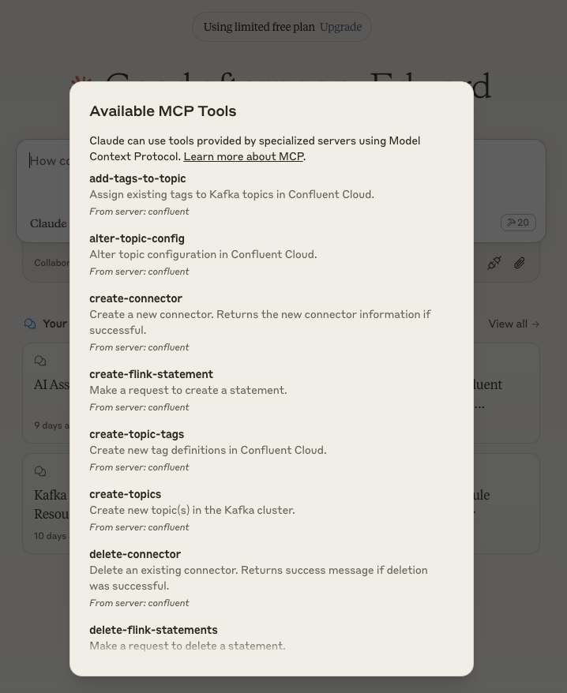

# Configuring Claude Desktop

See [here](https://modelcontextprotocol.io/quickstart/user) for more details about installing Claude Desktop and MCP servers.

To configure Claude Desktop to use this MCP server:

1. **Open Claude Desktop Configuration**
   - On Mac: `~/Library/Application\ Support/Claude/claude_desktop_config.json`
   - On Windows: `%APPDATA%\Claude\claude_desktop_config.json`

2. **Edit Configuration File**
   - Open the config file in your preferred text editor
   - Add or modify the configuration using one of the following methods:

   <details>
   <summary>Option 1: Run from source</summary>

   ```json
   {
     "mcpServers": {
       "confluent": {
         "command": "node",
         "args": [
           "/path/to/confluent-mcp-server/dist/index.js",
           "--env-file",
           "/path/to/confluent-mcp-server/.env"
         ]
       }
     }
   }
   ```

   </details>

   <details>
   <summary>Option 2: Run from npx</summary>

   ```json
   {
     "mcpServers": {
       "confluent": {
         "command": "npx",
         "args": [
           "-y",
           "@confluentinc/mcp-confluent",
           "-e",
           "/path/to/confluent-mcp-server/.env"
         ]
       }
     }
   }
   ```

   </details>

   Replace `/path/to/confluent-mcp-server/` with the actual path where you've installed this MCP server.

3. **Restart Claude Desktop**
   - Close and reopen Claude Desktop for the changes to take effect
   - The MCP server will automatically start when Claude Desktop launches

Now Claude Desktop will be configured to use your local MCP server for Confluent interactions.


