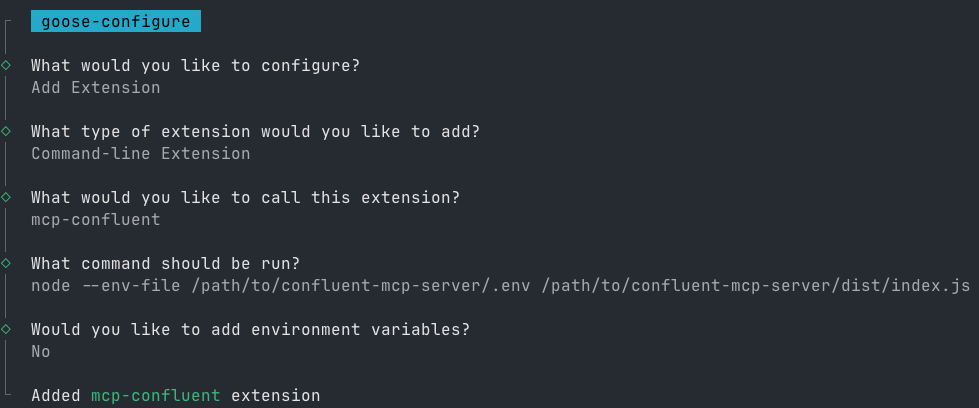

# Configuring Goose CLI

See [here](https://block.github.io/goose/docs/quickstart#install-an-extension) for detailed instructions on how to install the Goose CLI.

Once installed, follow these steps:

1. **Run the Configuration Command:**

   ```bash
   goose configure
   ```

2. **Follow the Interactive Prompts:**
   - Select `Add extension`
   - Choose `Command-line Extension`
   - Enter `mcp-confluent` as the extension name
   - Choose one of the following configuration methods:

   <details>
   <summary>Option 1: Run from source</summary>

   ```bash
   node /path/to/confluent-mcp-server/dist/index.js --env-file /path/to/confluent-mcp-server/.env
   ```

   </details>

   <details>
   <summary>Option 2: Run from npx</summary>

   ```bash
   npx -y @confluentinc/mcp-confluent -e /path/to/confluent-mcp-server/.env
   ```

   </details>

Replace `/path/to/confluent-mcp-server/` with the actual path where you've installed this MCP server.


